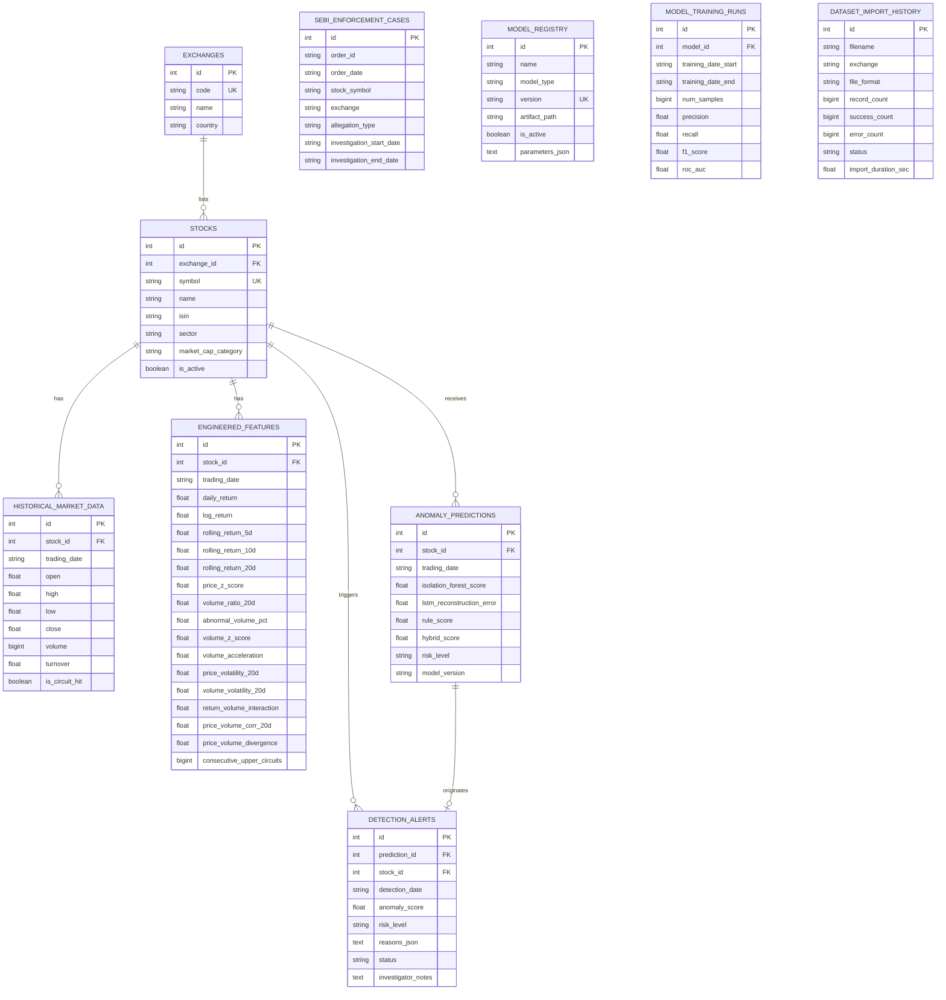

# Database Schema Specification

The application employs a normalized relational schema configured for PostgreSQL (with optional TimescaleDB extension) and SQLite for local development.

```mermaid
erDiagram
    EXCHANGES ||--o{ STOCKS : lists
    STOCKS ||--o{ HISTORICAL_MARKET_DATA : has
    STOCKS ||--o{ ENGINEERED_FEATURES : has
    STOCKS ||--o{ ANOMALY_PREDICTIONS : receives
    STOCKS ||--o{ DETECTION_ALERTS : triggers
    ANOMALY_PREDICTIONS ||--o| DETECTION_ALERTS : originates

    EXCHANGES {
        int id PK
        string code UK
        string name
        string country
    }

    STOCKS {
        int id PK
        int exchange_id FK
        string symbol UK
        string name
        string isin
        string sector
        string market_cap_category
        boolean is_active
    }

    HISTORICAL_MARKET_DATA {
        int id PK
        int stock_id FK
        string trading_date
        float open
        float high
        float low
        float close
        bigint volume
        float turnover
        boolean is_circuit_hit
    }

    ENGINEERED_FEATURES {
        int id PK
        int stock_id FK
        string trading_date
        float daily_return
        float log_return
        float rolling_return_5d
        float rolling_return_10d
        float rolling_return_20d
        float price_z_score
        float volume_ratio_20d
        float abnormal_volume_pct
        float volume_z_score
        float volume_acceleration
        float price_volatility_20d
        float volume_volatility_20d
        float return_volume_interaction
        float price_volume_corr_20d
        float price_volume_divergence
        bigint consecutive_upper_circuits
    }

    ANOMALY_PREDICTIONS {
        int id PK
        int stock_id FK
        string trading_date
        float isolation_forest_score
        float lstm_reconstruction_error
        float rule_score
        float hybrid_score
        string risk_level
        string model_version
    }

    DETECTION_ALERTS {
        int id PK
        int prediction_id FK
        int stock_id FK
        string detection_date
        float anomaly_score
        string risk_level
        text reasons_json
        string status
        text investigator_notes
    }

    SEBI_ENFORCEMENT_CASES {
        int id PK
        string order_id
        string order_date
        string stock_symbol
        string exchange
        string allegation_type
        string investigation_start_date
        string investigation_end_date
    }

    MODEL_REGISTRY {
        int id PK
        string name
        string model_type
        string version UK
        string artifact_path
        boolean is_active
        text parameters_json
    }

    MODEL_TRAINING_RUNS {
        int id PK
        int model_id FK
        string training_date_start
        string training_date_end
        bigint num_samples
        float precision
        float recall
        float f1_score
        float roc_auc
    }

    DATASET_IMPORT_HISTORY {
        int id PK
        string filename
        string exchange
        string file_format
        bigint record_count
        bigint success_count
        bigint error_count
        string status
        float import_duration_sec
    }
```
